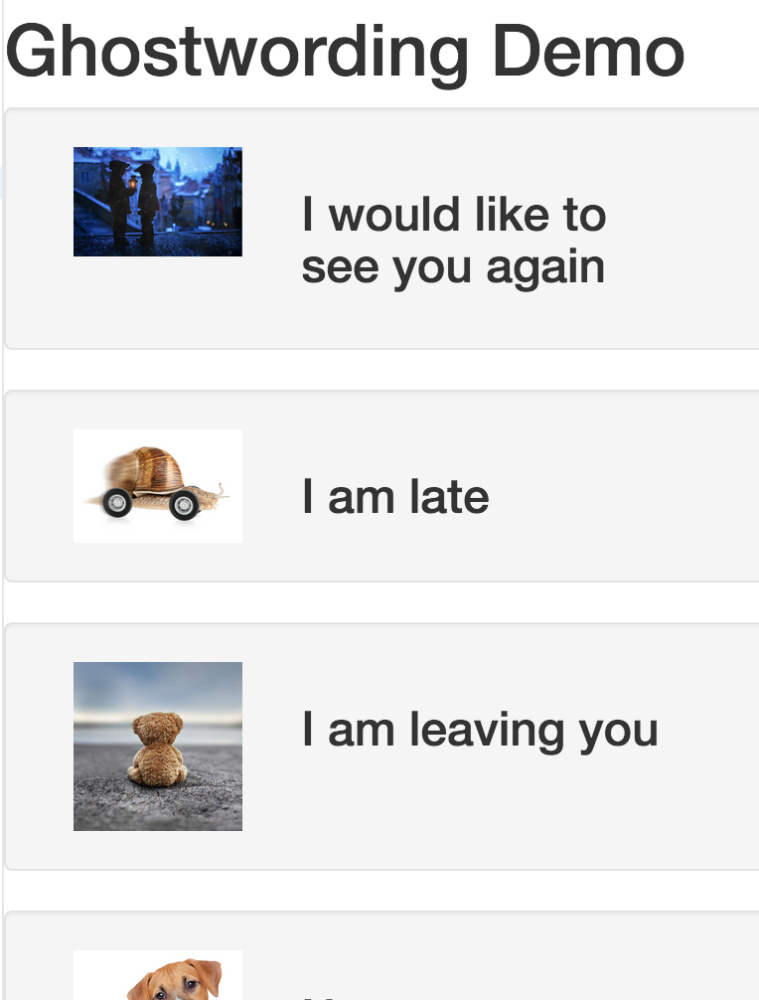
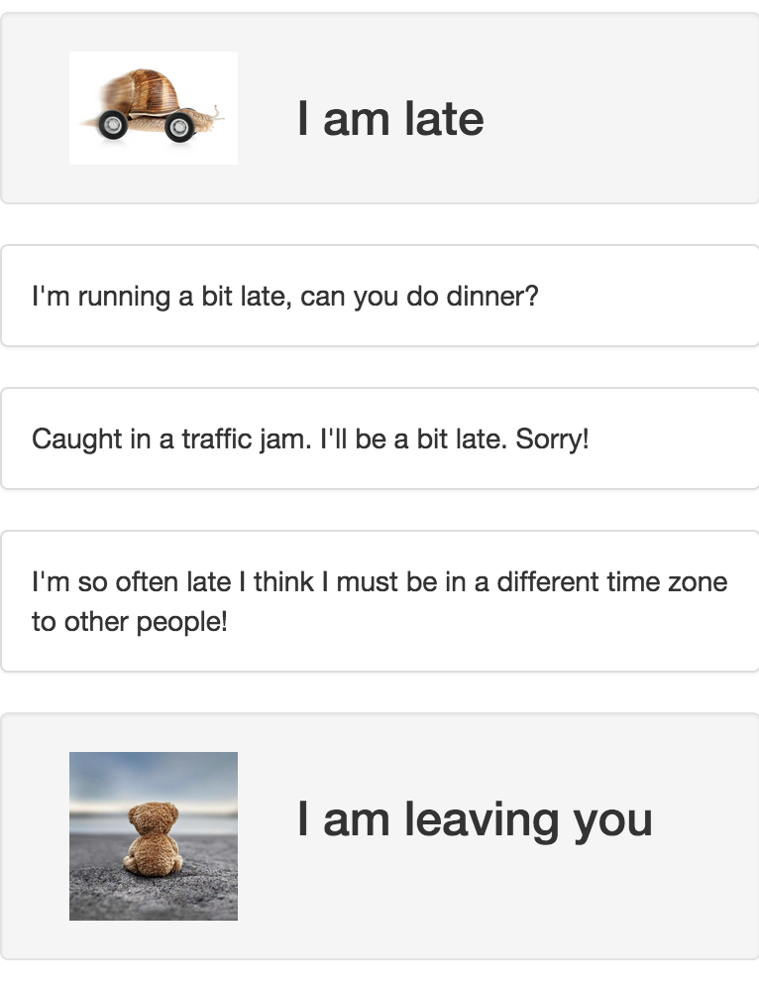

# User Guide : How to build a simple Ghostwording app

This is a hands-on tutorial to explain the logic and main services of the Ghostwording API, it will guide through a simple web 
application that covers the principal services used. 

For the simplicity and shortness of the exemples we'll use Angular (v1) and you'll find links to the live sample on [jsbin](http://jsbin.com/judixa/) 
for each step.

_Ghostwording is a smart platform that provides ideas of texts and quotes for people depending on a context. That context is 
mainly identified by a category (called intention), which defines the type of intention you want to express with your text, 
your profile, the profile of the recipient of the text and a few tags defining more precisely the style of the text. For this 
tutorial, we'll cover the basics of retrieving texts by category which is the base of the navigation inside the apis._

**Note** : for all the demos you'll use [http://api.cvd.io](http://api.cvd.io) as the root
point for your API calls.


## Step 01 : Setup the application


Start creating an html page with the angular and bootstrap imports, it will be the frame for our single page application:
```html
    <!DOCTYPE html>
    <html lang="en">
      <head>
        <meta name="description" content="Ghoswording APIs simple but complete demo with application,intentions,texts and userevents">
        <script src="https://code.jquery.com/jquery.min.js"></script>
        <link href="https://maxcdn.bootstrapcdn.com/bootstrap/3.3.5/css/bootstrap.min.css" rel="stylesheet" type="text/css" />
        <script src="https://maxcdn.bootstrapcdn.com/bootstrap/3.3.5/js/bootstrap.min.js"></script>

        <meta name="viewport" content="width=device-width, initial-scale=1.0, maximum-scale=1.0, user-scalable=no">
        <script src="https://rawgit.com/angular/bower-angular/master/angular.min.js"></script>
        <script src="https://rawgit.com/angular/bower-angular-resource/master/angular-resource.min.js"></script>
        <script src="gwdemo.js"></script>
        <meta charset="utf-8">
        <title>My GhostWording Demo</title>
    </head>
      
    <body ng-app="gwDemo">
      <h1>Ghostwording Demo</h1>
      
    </body>
    </html>
```
In order to finish the setup we'll also create the angular module in the `gwdemo.js` file:

```javascript
    // ***************************************
    // Main
    // ***************************************
    var gwDemo = angular.module('gwDemo',['ngResource']);
    var appNameArea = 'DocDemo';
    var userLanguage = 'en-EN';

```

_**Note** that we'll use Angular $resource module in order to simplify code and focus on
API calls._

We set in the code the [Area](../Sections/areas.md) for this application to `DocDemo`
(`appNameArea` variable).
This area with it's intentions are actually set by the admin for your application.

Check it live [Here](http://output.jsbin.com/judixa/3)


## Step 02 : Get The Intentions

The first step for a Ghostworing application is to get the intentions, or categories,
of texts you'll work with.

You'll simply need to ask that provinding the area name:

    GET /{area-name}/intentions

**Important** : note that most calls to the Ghostwording apis are culturized, the server
uses the standard HTTP `Accept-Language` header to find the most suitable culture to 
use for the client call but you can explicitely override that header if you want to 
provide a multi-cultural user interface within your application (we'll use that in that
demo).

We'll start creating an api service used by a single controller called `intentionsController`.
The controller will use the resource `intentions` and map it to the scope calling the 
`getAll` method.

That method is an explicit `GET` call the api `http://api.cvd.io/DocDemo/intentions` 
with the headers `accept:application/json` and `accept-language:en-EN`. Note that the 
API currently only supports `json` file format. 


```javascript
// ***************************************
// Services
// ***************************************
var api = function ($resource) {
  this.intentions = $resource("http://api.cvd.io/"+appNameArea+"/intentions",{},{
    getAll:
    {
      method:'GET',
      cache:true,
      isArray : true,
      headers: {
        "Accept":"application/json",
        "Accept-Language":userLanguage},
      params:{}
    }
    //note: if you don't set accept-language manually, it
    // will take the one automatically provided by your browser
  }); 
  
};

gwDemo.service("api", api);

// ***************************************
// Controllers
// ***************************************
gwDemo.controller('intentionsController', function ($scope, api, $http) {
  $scope.intentions  = api.intentions.getAll();
  console.log($scope.intentions);
});
```


Let's add some html to show our intentions:

```html

<div ng-controller="intentionsController" class="container-fluid">
  <div ng-repeat="intention in intentions">
    <div class="row well">
       <div class="col-xs-4 ">
          
       </div>
    
       <div class="col-xs-8 vcenter">
         <h3>{{intention.Label}}</h3> 
       </div>
    </div>  
    
  </div>
  </div>
  

```

On the html for this step, we have added a loop to show all the intentions we mapped 
in javascript withing the scope (`ng-repeat:intention in intentions`) and for each intention
we show it's label (in the prefered culture) and an image associated with that intention.

We added a `console.log($scope.intentions` within the controller to help you having a look
of all the properties of an intention, just open your console and watch them.

You can also check the demo live for this step [Here](http://output.jsbin.com/judixa/4).

Here we are now:



**Test:** _give it a try and change the culture to `fr-FR` to see the change:_

        var userLanguage = 'fr-FR';
 
 

## Step 03 : Get the texts

The feature we add now is that each time we click on an intention it will load from
the server the list of texts associated with that intention. 

To load the texts, we'll call the texts api by providing the `slug` of the intention, 
which is a textual -human readable- id for the text that you'll have within the intention
properties:

    GET /{areaName}/{intentionSlug}/texts
    
Note that we'll also provide the area name in order to identify your app and that the
`accept-langage` is also used to find the texts in the prefered user language. 

Let's add the resource call to the api for the texts:

```javascript
this.texts = $resource("http://api.cvd.io/"+appNameArea+"/:intention/texts",{intention:'@intention'},{ 
    getAll:
    {
      method:'GET',
      cache:true,
      isArray : true,
      headers: {
        "Accept":"application/json",
        "Accept-Language":userLanguage},
      params:{}
    }
  });
  ```
  
  Then within the **intentionController** add a select method that will load the texts
  from a click on the intention:
  
  ```javascript
  
  gwDemo.controller('intentionsController', function ($scope, api, $http) {
  $scope.intentions  = api.intentions.getAll();
  
  console.log($scope.intentions);
  
  $scope.select = function(intention){
    if(intention.texts !== undefined)
      {
        intention.texts = undefined;
      } else
      {
        console.log(intention.texts);
        intention.texts = api.texts.getAll({intention:intention.SlugPrototypeLink});
      }
  };
});
  
  ```
  
  We'll attach the texts directly to the intention object within a `texts` property and 
  note that we put a console.log with the texts in order for you to see the format and
  properties of a text.
  
  When you call the texts api, you'll get all the texts corresponding to your intention/culture.
  It's actually by design, we choose to not use pagination here to simplify the api and
  due to most common use of the api (with offline modes), we let the app designer choose
  the process of caching and paginate localy that fits better for it's app.
  
  In order to shrink the page and show only the first 5 texts, we'll add a small angular
  filter that we'll use directly in the html:
  
  ```javascript
  gwDemo.filter('slice', function() {
  return function(arr, start,end) {
    
    if(arr===undefined)
      {
        return arr;
      }
    
    return arr.slice(start, end);
  };
});
```

Then add the row corresponding to your texts bloc within the repeat bloc above the 
intention information row:

```html
    <div class="row" ng-show="intention.texts">
       <div class="panel panel-default" ng-repeat="text in intention.texts | slice:0:3">
          <div class="panel-body">
            {{text.Content}}
          </div>
       </div>
    </div>
```

Here is how your application looks like at the step 3:



You can also check the demo live for this step [Here](http://output.jsbin.com/judixa/6).


